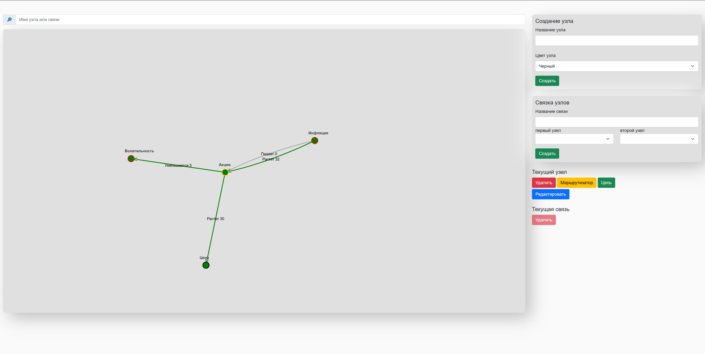
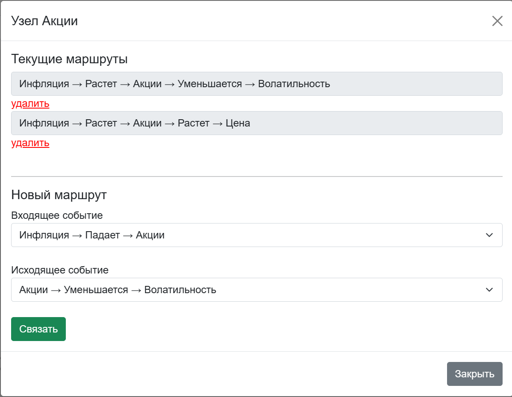
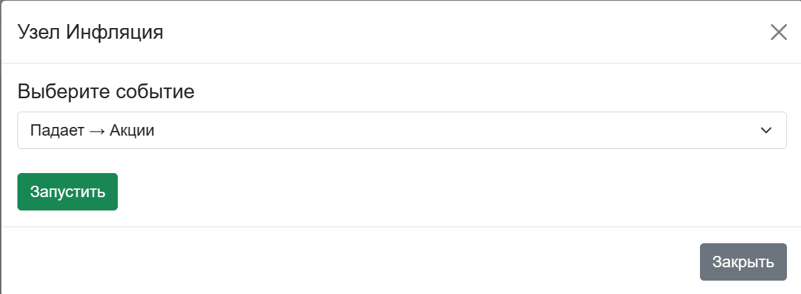

## The web-app is used for building **causal relationships**.  
For example, it is possible to simulate the relationships between such entities as:
- Stocks
- Inflation
- Volatility

> In case the Inflation increasing, Stock's price increasing too but Stocks's Volatility decreasing

On the diagram it is shown as 4 markers. The Stock point is a **router** used to route actions between Inflation marker and other markers.  

## The app has the following features:
- Set marker
  - Color
  - Search
- Link markers with multiple events
  - Search links
- Route actions in router as sequences

- Call event's chain to color route

- Move and zoom the canvas 


##Dependencies
- min python v. == 3.7
- Neo4J
- Vue.js
- d3.js

###CYPHER
- create node
- get node by id
- link two nodes
- delete node
- delete link
- get all nodes
- get all links
- set node params

**CREATE node in table (table can be not existed):**\
- `CREATE (n: TableName)`
- `CREATE (n: TableName {title: 'Title')`

**GET node by id**\
`MATCH (n: TableName) WHERE ID(n) = 1 RETURN n`

**GET nodes by property**
`MATCH (n: TableName {title: 'Title'}) RETURN n`

**DELETE table**\
`MATCH (n: TableName) DELETE n`

**SET new properties on a node**\
`MATCH (n:TableName) WHERE ID(n) = 1 SET n.title = 'Title'`

**LINK two nodes**
```
MATCH (n1:TableName), (n2:TableName)
WHERE ID(n1) = 1 AND ID(n2) = 2
CREATE (n1)-[link:LinkName]->(n2)
```

**GET all relationships**
```MATCH (n:TableName)-[r]-() RETURN r```


**GET relationship by id**
```MATCH (n:TableName)-[r]-() WHERE ID(r)=1 RETURN r```

<hr>

###LINTER

**Execute check**\
`pylint <folder or file name with extension>`

**Make conf file**\
`pylint --generate-rcfile > .pylintrc`
 
<hr>
 
### VENV [Windows]  
**Activate**
- on Windows: `venv/Scripts/activate`
- on Linux: `source venv/bin/activate`

**Deactivate:**\
`deactivate`

**Save packages names in file**\
`pip freeze > requirements.txt`

<hr>

###TESTS
**Run tests**\
`python tests.py`

<hr>

###RUN
**Run program**\
`python server/main.py`
